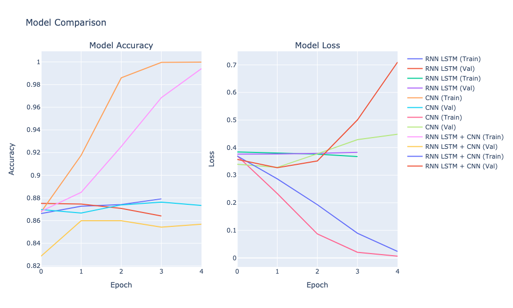

# Sentiment Analysis with PySpark and PyTorch

# NLP_PySpark + PyTorch
After trying TensorFlow and PyTorch, I want to utilize PySpark which is good for massive dataset. The project uses PySpark for efficient data preprocessing and PyTorch for building and training the deep learning models.


## Project Description

This project performs sentiment analysis on Amazon Automotive product reviews. It classifies reviews as positive or negative based on the review text, demonstrating the use of distributed computing for natural language processing tasks.
my purpose is to implement and compare three deep learning models for the analysis:
1. RNN LSTM
2. CNN
3. RNN LSTM + CNN

### Key Features:
- Data preprocessing using PySpark
- Text feature extraction using TF-IDF
- Binary classification using Logistic Regression
- Model evaluation using Area Under ROC and Accuracy metrics

## Why PySpark?

While TensorFlow and PyTorch are excellent choices for deep learning models, we chose PySpark for this project for several reasons:

1. **Scalability**: PySpark is designed to handle very large datasets that may not fit into the memory of a single machine. It can distribute data processing across a cluster of computers, making it ideal for big data scenarios.

2. **Integrated Analytics**: PySpark provides a unified engine for large-scale data processing and machine learning. It allows us to perform data loading, preprocessing, model training, and evaluation all within the same framework.

3. **Simplified ML Pipeline**: PySpark's MLlib offers a high-level API for building machine learning pipelines, making it easier to assemble and tune ML workflows.

4. **Performance for Large Datasets**: For very large datasets, PySpark can outperform single-machine solutions by leveraging distributed computing resources.

5. **Business Reality**: In many business scenarios, simple models that can process vast amounts of data quickly are more valuable than complex models that take longer to train and deploy.

6. **Easy Integration**: If this project needs to be integrated into a larger data processing ecosystem (e.g., Hadoop ecosystem), PySpark makes this integration seamless.

While deep learning models (like those built with TensorFlow or PyTorch) could potentially achieve higher accuracy for this task, the PySpark solution offers a good balance of performance, scalability, and simplicity, especially when dealing with large-scale text data.

## Environment

- Machine: MacBook with M3 Pro chip (MPS device used for GPU acceleration)
- Python version: 3.9
- Main libraries: PySpark 3.4.1, PyTorch 1.9.0+

## Setup and Installation

1. Clone the repository
2. Create a virtual environment:
   ```
   conda create -n <environment name> python=3.9
   conda activate <environment name>

   ```
3. Install the required packages:
   ```
   pip install -r requirements.txt
   ```

## Requirements

- Python 3.7+
- PySpark 3.4.1
- PyArrow 12.0.1
- Java 8 or later
- Torch

## Project Structure

```
amazon_reviews_sentiment/
│
├── data/
│   └── reviews_Automotive_5.json.gz
│
├── src/
│   ├── __init__.py
│   ├── data_processing.py
│   ├── model.py
│   └── utils.py
│
├── main.py
├── requirements.txt
└── README.md
```


4. Ensure your `reviews_Automotive_5.json.gz` file is in the `data/` directory.

5. Run the main script:
   ```
   python main.py
   ```

## Results


After training with early stopping (maximum 10 epochs, patience of 3):

1. RNN LSTM (Trained for 8 epochs):
   - Train Loss: 0.0983, Train Acc: 0.9689
   - Val Loss: 0.4567, Val Acc: 0.8515
   - Test Loss: 0.3527, Test Accuracy: 0.8688

2. CNN (Trained for 5 epochs):
   - Train Loss: 0.0071, Train Acc: 0.9998
   - Val Loss: 0.4333, Val Acc: 0.8704
   - Test Loss: 0.3312, Test Accuracy: 0.8718

3. RNN LSTM + CNN (Trained for 5 epochs):
   - Train Loss: 0.0288, Train Acc: 0.9914
   - Val Loss: 0.6986, Val Acc: 0.8352
   - Test Loss: 0.3360, Test Accuracy: 0.8425

The training process took approximately 74.32 seconds to run.


## Performance Comparison

The following plot shows the training and validation accuracy and loss for all three models over the training epochs:



### Observations from the plot:

1. **Accuracy (left plot):**
   - All models show improvement in both training and validation accuracy over time.
   - The CNN model (green) shows the fastest increase in training accuracy, reaching near 100% quickly.
   - The RNN LSTM model (blue) shows a more gradual increase in accuracy for both training and validation.
   - The RNN LSTM + CNN model (red) shows a pattern similar to CNN but with slightly lower validation accuracy.

2. **Loss (right plot):**
   - All models show a decrease in both training and validation loss over time.
   - The CNN model's training loss decreases very rapidly, almost reaching zero.
   - The RNN LSTM model shows a more gradual decrease in both training and validation loss.
   - The RNN LSTM + CNN model's loss decrease pattern is similar to CNN but with higher validation loss.

3. **Overfitting:**
   - The gap between training and validation metrics (especially for CNN and RNN LSTM + CNN) suggests some degree of overfitting.
   - The RNN LSTM model seems to have the least overfitting, with training and validation metrics staying closer together.

4. **Early Stopping:**
   - The plots show where early stopping occurred for each model, as indicated by the end of each line.
   - CNN and RNN LSTM + CNN stopped earlier than RNN LSTM, likely due to the early stopping mechanism detecting potential overfitting.

These visualizations support our numerical results and provide insights into the learning dynamics of each model throughout the training process.


## Key Takeaways

1. All models achieved good performance, with test accuracies around 84-87%.
2. The CNN model showed the fastest convergence and best performance, reaching near-perfect training accuracy by the 5th epoch. However, the gap between training and validation accuracy suggests some overfitting.
3. The RNN LSTM model showed more stable performance, with less overfitting than the CNN model.
4. The combined RNN LSTM + CNN model didn't outperform the individual models, suggesting that the additional complexity might not be beneficial for this task.
5. Early stopping was effective in preventing overfitting, with all models stopping before the maximum number of epochs.
6. The CNN model achieved the highest test accuracy, followed closely by the RNN LSTM model.

## Note on TensorFlow vs. PyTorch

Initially, we attempted to use TensorFlow for this project. However, we encountered persistent crashes related to protobuf compatibility issues on the M3 Mac. As a result, we switched to PyTorch, which provided better compatibility and performance on this hardware.

It's worth noting that these issues might be specific to the M3 Mac architecture, and users with different hardware configurations might not encounter the same problems with TensorFlow.

## Future Work

1. Fine-tune hyperparameters for each model to potentially improve performance.
2. Experiment with pre-trained word embeddings like Word2Vec or GloVe.
3. Implement cross-validation for more robust evaluation.
4. Explore attention mechanisms to potentially improve the RNN LSTM model.
5. Analyze misclassified examples to gain insights for further improvements.
6. Investigate ways to reduce overfitting in the CNN model.
7. Experiment with different architectures for the combined RNN LSTM + CNN model to see if its performance can be improved.
